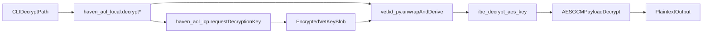

# Implement VetKD Transport Unwrap + Flow Fixes

## Goals
- Enable real decryption in Haven CLI for both byte payloads and streaming files by completing the ICP VetKD chain (`EncryptedVetKey -> VetKey -> IBE key unwrap -> AES-GCM decrypt`).
- Keep strict fail-closed behavior when cryptographic prerequisites are missing or invalid.
- Fix adjacent access-pattern and CID-threshold mismatches (`public`, `owner_only`, non-numeric threshold paths) in the same PR.
- Introduce `vetkd_py` as a standalone package suitable for independent release on PyPI.

## Architecture

## Implementation Plan
- Build `vetkd_py` package (new top-level package in-repo) with Rust+PyO3 wrappers over `ic-vetkeys`:
  - Expose typed APIs for:
    - transport keypair generation/serialization
    - `EncryptedVetKey` deserialize + `decrypt_and_verify`
    - deterministic symmetric key derivation for AOL decrypt material
  - Add Python type stubs/annotations and strict error mapping (decode/verify/derive failures).
  - Add packaging files for wheel/sdist builds and pinned compatibility constraints.

- Integrate `vetkd_py` into ICP service and crypto layers:
  - Update [haven_cli/services/haven_aol_icp.py](haven_cli/services/haven_aol_icp.py):
    - load/validate both `HAVEN_AOL_TRANSPORT_PUBLIC_KEY_B64` and `HAVEN_AOL_TRANSPORT_SECRET_KEY_B64`
    - enforce keypair consistency and fail early with explicit errors
    - keep RPC concerns only (still returns canister bytes + proof flow)
  - Update [haven_cli/crypto/haven_aol_local.py](haven_cli/crypto/haven_aol_local.py):
    - replace placeholder runtime errors in `decrypt_bytes` and `decrypt_file_streaming`
    - add internal decrypt chain that unwraps canister bytes with `vetkd_py`, derives AOL-compatible key material, performs IBE AES-key decrypt, then AES-GCM decrypts payload/chunks
    - remove legacy XOR unwrap usage from active decrypt path and keep no-fallback semantics

- Correct access pattern and CID gating mismatches in pipeline/CLI:
  - Update [haven_cli/pipeline/steps/encrypt_step.py](haven_cli/pipeline/steps/encrypt_step.py):
    - make `owner_only` and `public` condition generation compatible with downstream token-address/threshold assumptions
    - ensure normalized gate model can produce valid derivation input across all supported patterns
  - Update [haven_cli/pipeline/steps/upload_step.py](haven_cli/pipeline/steps/upload_step.py):
    - make CID encryption threshold extraction robust for non-numeric `returnValueTest.value`
    - preserve deterministic behavior for owner/public without ValueError failures
  - Update [haven_cli/cli/download.py](haven_cli/cli/download.py):
    - align metadata-to-`GateParams` parsing with normalized rules (no brittle int-only assumptions)

- Tighten configuration and docs:
  - Update [haven_cli/config.py](haven_cli/config.py) and [haven_cli/cli/config.py](haven_cli/cli/config.py):
    - validate transport secret/public env requirements for decrypt-capable mode
    - present new env fields in config inspect/output
  - Update docs in [docs/HAVEN_AOL_VETKD_TRANSPORT_UNWRAP.md](docs/HAVEN_AOL_VETKD_TRANSPORT_UNWRAP.md), [docs/configuration.md](docs/configuration.md), [docs/API_REFERENCE.md](docs/API_REFERENCE.md), [docs/INTEGRATION_GUIDE.md](docs/INTEGRATION_GUIDE.md) to reflect final runtime behavior and env setup.

## Testing Strategy
- Unit tests for `vetkd_py` wrapper behavior (success + decode/verify mismatch + key mismatch + malformed blob).
- Replace current "decrypt disabled" assertions with real decrypt-path tests in:
  - [tests/crypto/test_haven_aol_local.py](tests/crypto/test_haven_aol_local.py)
  - [tests/cli/test_download.py](tests/cli/test_download.py)
- Expand ICP service tests in [tests/services/test_haven_aol_icp.py](tests/services/test_haven_aol_icp.py) for transport secret/public validation and typed errors.
- Add/adjust pipeline tests for owner/public/token/nft patterns and CID encryption/decryption compatibility:
  - [tests/pipeline/test_encrypt_step.py](tests/pipeline/test_encrypt_step.py)
  - related upload step tests.
- Ensure new/changed code paths reach 100% unit-test coverage with typed interfaces only.

## Delivery Sequence
1. Scaffold `vetkd_py` package and lock API contracts.
2. Integrate decrypt chain in `haven_aol_local.py` with fail-closed error handling.
3. Wire env/config validation and ICP transport-key requirements.
4. Apply access-pattern/CID parsing fixes across encrypt/upload/download.
5. Update docs and finalize comprehensive tests.
6. Run full test suite and lint checks, then prepare PR notes.