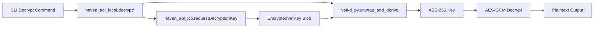

# Haven-AOL VetKD Transport Unwrap

## Overview

Haven-CLI now supports full end-to-end decryption of Haven-AOL encrypted content using the ICP VetKD (Verifiable Encrypted Threshold Key Derivation) protocol. This document describes the transport-key unwrap mechanism and its integration into the decrypt path.

## Architecture



## Decrypt Chain

The full decryption chain performs these steps in order:

1. **Compute derivation input** — SHA-256 hash of `accessol:{chain}:{tokenAddress}:{threshold}:{cid}`
2. **Fetch verification key** — `getVetKDPublicKey()` canister call returns the DerivedPublicKey
3. **Request encrypted derived key** — `requestDecryptionKey(GateRequest)` canister call with EVM EIP-712 signature proof; returns `EncryptedVetKey` blob encrypted to the transport public key
4. **Transport unwrap** — `vetkd_py.decrypt_and_verify()` uses the local transport secret key to decrypt the `EncryptedVetKey` into a `VetKey`
5. **IBE decrypt** — `vetkd_py.ibe_decrypt()` uses the `VetKey` to recover the 32-byte AES key from the IBE ciphertext
6. **AES-GCM decrypt** — Standard AES-256-GCM decryption of the payload/chunks

Steps 4 and 5 are combined into a single `vetkd_py.unwrap_and_derive()` call for efficiency.

## Transport Keypair

The transport keypair is an ephemeral (or semi-persistent) key used to encrypt the canister's response in transit. The canister encrypts the derived VetKD key to the caller's transport public key, ensuring only the caller can unwrap it.

### Generation

```python
import vetkd_py
import base64

# Generate once, store securely
secret_key = vetkd_py.generate_transport_secret_key()
public_key = vetkd_py.transport_public_key_from_secret(secret_key)

# Store as base64 in environment
print(f"HAVEN_AOL_TRANSPORT_SECRET_KEY_B64={base64.b64encode(secret_key).decode()}")
print(f"HAVEN_AOL_TRANSPORT_PUBLIC_KEY_B64={base64.b64encode(public_key).decode()}")
```

### Environment Variables

| Variable | Required | Description |
|----------|----------|-------------|
| `HAVEN_AOL_TRANSPORT_SECRET_KEY_B64` | For decrypt | Base64-encoded transport secret key (never transmit) |
| `HAVEN_AOL_TRANSPORT_PUBLIC_KEY_B64` | For decrypt | Base64-encoded transport public key (sent to canister) |

Both must be set together. The CLI validates consistency at startup when encryption is enabled.

## Fail-Closed Behavior

The decrypt path is **fail-closed** — any failure at any step results in a `RuntimeError` with no fallback:

- Missing transport keys → `RuntimeError`
- Inconsistent keypair → `RuntimeError`
- `vetkd_py` not installed → `RuntimeError`
- EncryptedVetKey deserialization failure → `RuntimeError`
- VetKey verification failure (wrong key) → `RuntimeError`
- IBE decryption failure → `RuntimeError`
- AES-GCM authentication failure → `RuntimeError`

There is **no XOR fallback**, **no partial decrypt**, and **no silent degradation**.

## vetkd_py Package

The `vetkd_py` package is a standalone Rust+PyO3 crate that wraps the `ic-vetkeys` library. It is located at `vetkd_py/` in the repository and is the **single cryptographic dependency** for all Haven-AOL VetKD operations (both encrypt and decrypt paths), replacing the previous split between `haven_aol`/`haven_aol_vetkeys` (encrypt) and `vetkd_py` (decrypt).

### Building

```bash
cd vetkd_py
pip install maturin
maturin develop  # Development install
# or
maturin build --release  # Build wheel
```

### API

| Function | Description |
|----------|-------------|
| `generate_transport_secret_key()` | Generate random transport secret key |
| `transport_public_key_from_secret(sk)` | Derive public key from secret |
| `decrypt_and_verify(enc, sk, vk, di)` | Transport unwrap: EncryptedVetKey → VetKey |
| `ibe_decrypt(ct, vk)` | IBE decrypt: IbeCiphertext + VetKey → plaintext |
| `unwrap_and_derive(enc, sk, vk, di, ct)` | Combined: transport unwrap + IBE decrypt |
| `derive_verification_key(name, cid, ctx)` | Offline key derivation from mainnet master |
| `deserialize_derived_public_key(bytes)` | Validate DerivedPublicKey bytes (encrypt path uses this) |
| `ibe_encrypt(dpk, id, pt)` | IBE encrypt: wraps AES key under IBE identity (encrypt path) |

## Configuration Validation

When `pipeline.encryption_enabled = true`, the config validator checks:

1. `HAVEN_ICP_IDENTITY_PEM_PATH` is set (required for canister calls)
2. If either transport key env var is set, both must be set
3. Both transport key env vars must be valid base64
4. `pipeline.evm_chain` must be a valid Haven-AOL chain name

## Streaming Decrypt

For files encrypted with `encrypt_file_streaming`, the decrypt uses chunked streaming:

1. Read 12-byte base IV from file header
2. For each chunk: read 4-byte index + 4-byte length + encrypted chunk data
3. Derive per-chunk IV: `base_iv XOR chunk_index` (in bytes 4-11)
4. AES-GCM decrypt each chunk independently
5. Write plaintext chunks to output file

This allows decryption of arbitrarily large files without loading them entirely into memory.

## Related Files

- `vetkd_py/` — Rust+PyO3 package
- `haven_cli/crypto/haven_aol_local.py` — Encrypt/decrypt implementation
- `haven_cli/services/haven_aol_icp.py` — ICP canister client
- `haven_cli/cli/download.py` — CLI decrypt command
- `haven_cli/config.py` — Transport key validation
- `tests/crypto/test_haven_aol_local.py` — Unit tests
